# Elytras+

Pacote de recursos com 64 skins de Elytra baseadas no nome do item (CIT).

Crédito e licença

- Criado originalmente por TheTerrain
- Licença: [Creative Commons BY-NC-ND 4.0](https://creativecommons.org/licenses/by-nc-nd/4.0/)

## Como usar no jogo

1. Coloque a pasta `resource/` como seu resource pack (ou compacte o conteúdo em .zip).

2. Ative o pack nas opções do Minecraft.

3. Renomeie sua Elytra na bigorna com um dos nomes listados abaixo (não diferencia maiúsculas/minúsculas).

4. Instale o mod deste projeto (Elytra Name): copie o JAR gerado em `build/elytra-name.x.x.x.jar` para a pasta `mods/` do seu Minecraft. O resource pack para baixar também ficará em `build/elytra-name.zip`.

- Texturas: `resource/assets/minecraft/textures/optifine/cit/elytra/{icon,model}`

- Regras (.properties):

  - `resource/assets/minecraft/optifine/cit/elytra/properties`

- Hotfix (Fabric): garantir `texture.elytra=` em todas as regras de Elytra:
  - `python3 scripts/fix_elytra_texture_key.py`

## Skins e nomes na bigorna

Legendas:

- \# : número da skin na lista
- Name: nome descritivo da skin
- Name in Anvil: nomes a ser colocado na bigorna
- Image: ícone ilustrativo (miniatura)

| #  | Name                     | Name in Anvil                | Image                                                                                                  |
| -- | ------------------------ | ---------------------------- | ------------------------------------------------------------------------------------------------------ |
| 1  | TheTerrain               | "TheTerrain", "Handsome"     | 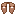              |
| 2  | Ivan                     | "Ivan"                       |                           |
| 3  | Dream                    | "Dream"                      | 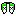                        |
| 4  | Technoblade              | "Technoblade", "Techno"      | 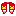            |
| 5  | Fundy                    | "Fundy", "Furry"             |                         |
| 6  | Fruitberries             | "fruitberries", "Gauntlet"   | 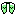          |
| 7  | Geosquare                | "Geosquare", "Tall Cactus"   | 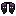                |
| 8  | CommandGeek              | "CommandGeek"                |                    |
| 9  | BlueCommander            | "BlueCommander"              |         |
| 10 | PaulGG                   | "PaulGG"                     | 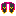                      |
| 11 | Slicedlime               | "Slicedlime"                 |               |
| 12 | Bill Wurtz               | "billwurtz"                  |                |
| 13 | Bed                      | "Bed"                        |                             |
| 14 | Cookie                   | "Cookie"                     | 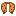                      |
| 15 | End Portal               | "Stronghold", "End Portal"   |                |
| 16 | Nether Portal            | "Nether Portal"              |          |
| 17 | Magma                    | "Magma"                      | 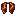                        |
| 18 | Gilded Blackstone        | "Blackstone", "Calvin"       | 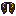 |
| 19 | Red Mushroom             | "Mushroom", "Red Mushroom"   |           |
| 20 | TNT                      | "TNT"                        |                             |
| 21 | Lava Bucket              | "Lava"                       |                    |
| 22 | Water Bucket             | "Water", "Bucket"            | 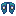                 |
| 23 | Coal Block               | "Coal"                       |                     |
| 24 | Iron Block               | "Iron"                       |                     |
| 25 | Gold Block               | "Gold"                       |                     |
| 26 | Redstone Block           | "Redstone"                   |             |
| 27 | Lapis Block              | "Lapis"                      |                   |
| 28 | Diamond Block            | "Diamond"                    |               |
| 29 | Emerald Block            | "Emerald"                    |               |
| 30 | Netherite Block          | "Netherite"                  |           |
| 31 | Hardcore Heart           | "Hardcore", "Philza"         |             |
| 32 | Hunger Icon              | "Food", "Hunger"             | 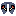                 |
| 33 | Golden Apple             | "Golden Apple", "Gapple"     |                 |
| 34 | Orange Fruit             | "Citrus", "Orange"           |                 |
| 35 | Graham Painting          | "Graham"                     | 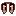    |
| 36 | Wanderer Painting        | "Wanderer"                   |      |
| 37 | Axolotl (Pink)           | "Blue Axolotl"               | 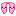        |
| 38 | Axolotl (Yellow)         | "Yellow Axolotl"             | 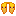    |
| 39 | Axolotl (Blue)           | "Blue Axolotl"               | 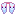        |
| 40 | Glow Squid               | "Glow Squid"                 |                |
| 41 | Iron Golem               | "Golem", "Iron Golem"        | 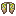               |
| 42 | Strider (Normal)         | "Strider"                    | 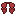    |
| 43 | Strider (Cold)           | "Cold Strider"               | 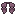        |
| 44 | Minecon (2011)           | "Minecon 2011"               |           |
| 45 | Minecon (2012)           | "Minecon 2012"               |           |
| 46 | Minecon (2013)           | "Minecon 2013"               | 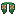          |
| 47 | Minecon (2015)           | "Minecon 2015"               | 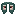          |
| 48 | Minecon (2016)           | "Minecon 2016"               |           |
| 49 | Turtle Cape              | "Turtle"                     |             |
| 50 | Bacon Cape               | "Bacon"                      |                    |
| 51 | Veteran Cape             | "Veteran", "Migration"       |           |
| 52 | Millionth Customer Cape  | "Millionth Customer"         |  |
| 53 | Snowman Cape             | "Julian Clark"               |            |
| 54 | Illustrator Palette      | "Illustrator", "AI"          |              |
| 55 | Photoshop Palette        | "PS"                         |                |
| 56 | Premiere Pro Palette     | "Premiere", "Pr"             |       |
| 57 | Synthesia Logo           | "Synthesia", "Piano"         |            |
| 58 | YouTube Logo             | "YouTube"                    |                |
| 59 | Twitter Logo             | "Twitter", "Tweet"           |                |
| 60 | Optifine Logo (Red)      | "Red Optfine"                | 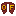   |
| 61 | Optifine Logo (Blue)     | "Blue Optifine"              |  |
| 62 | Rainbow Flag             | "Rainbow", "Pride"           |                |
| 63 | Solo-Jazz / Retro Design | "Solo Cup", "Solo"           | 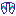                 |
| 64 | Vaporwave / Neon 80s     | "Vaporwave", "Synthwave"     |                 |

> Observação: para as entradas “Axolotl”, o guia original usa os nomes de bigorna correspondentes. As texturas seguem a convenção `axolotl_<cor>.png`.

---

Se alguma skin não aplicar no jogo, abra uma issue com:

- Nome usado na bigorna
  Obrigado por usar Elytras+!
